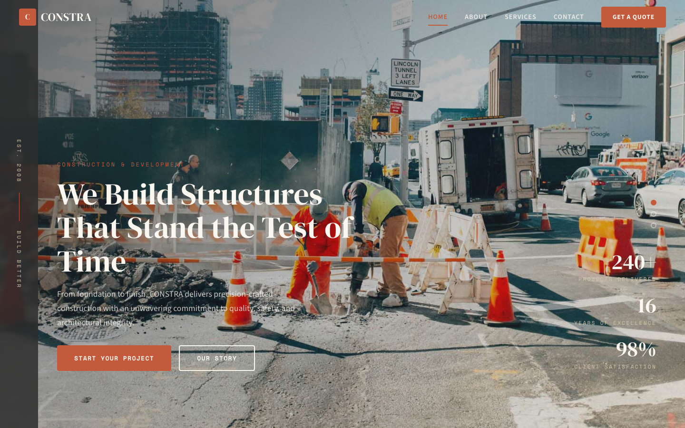

# CONSTRA — Construction Portfolio HTML Template

A premium, framework-free HTML/CSS/vanilla-JS template for construction, development, and architectural firms. Built bespoke from the subject — not a recolored scaffold.

**Live preview:** `index.html` (open in browser)
**Stack:** HTML5 · CSS3 (custom properties, Grid, Flex) · Vanilla JS (no build step)
**Fonts:** DM Serif Display (display) · Source Sans 3 (body) · Space Mono (labels/data) — all via Google Fonts
**License:** MIT — use commercially, modify freely.

---

## 📸 Screenshot



## Pages

| Page | Description | Link |
|------|-------------|------|
| **Home** | Full-viewport hero carousel (3 slides) with vertical text sidebar ("Est. 2008 / Build Better"), right-aligned stat column, dot navigation, animated counter band (4 metrics), vertical milestone timeline (5 milestones from 2008-2024), about section with 3-image mosaic, 4 service cards in 2-column grid, 4-column blog grid, earth-toned CTA banner, contact teaser with phone/email | [index.html](index.html) |
| **About** | Parallax page header, mission statement with 3-image mosaic, 3 core values (Precision/Safety/Sustainability) on dark background, vertical timeline (5 milestones), 3-person leadership team with photo cards, CTA banner | [about.html](about.html) |
| **Services** | Parallax page header, 6 detailed service cards (Commercial, Residential, Renovation, Project Management, Infrastructure, Pre-Construction) each with image, number badge, full description + inclusions list, 4-step process on dark background, CTA banner | [services.html](services.html) |
| **Contact** | Parallax page header, split layout with contact info items (phone, email, office, hours) + full quote form with service dropdown, embedded OpenStreetMap, CTA banner with direct call link | [contact.html](contact.html) |

---

## Design Distinction

**This template was authored fresh for a construction/architecture subject and diverges from every sibling template on all 6 divergence axes:**

| Axis | CONSTRA (this template) | Sibling templates (CEPAIR, AERION, VOSSEN, etc.) |
|------|------------------------|--------------------------------------------------|
| **Hero composition** | Full-viewport image carousel with vertical text sidebar (left edge, writing-mode: vertical-rl), bottom-left content overlay, right-aligned stat column, dot navigation. Hero reads like an architectural portfolio spread — wide image, editorial typography, generous whitespace. | CEPAIR: diagnostic scan-line with grid overlay. AERION: thermostat gauge dial. VOSSEN: split headline + image. Others: centered hero + buttons. |
| **Layout grammar** | Editorial-portfolio grammar: `.hero` (carousel + sidebar) → `.counter-grid` (4 animated numbers) → `.timeline` (vertical center-line with alternating items) → `.about-mosaic` (3-image grid) → `.services-grid` (2-column numbered cards) → `.blog-grid` (4-column) → `.cta-banner` (full-width image overlay). Content reads like a construction portfolio — milestones, projects, credentials. | CEPAIR: scan-line → service grid → about band → process steps. AERION: status bar → gauge → readouts → service grid. Others: standard section-stack. |
| **Typography personality** | **DM Serif Display** (display, elegant editorial serif with oldstyle figures) + **Source Sans 3** (body, neutral humanist sans) + **Space Mono** (labels, year markers, mono accents). Architectural-portfolio voice — refined, authoritative, editorial. Monospace used sparingly for dates/labels only. | CEPAIR: Chakra Petch (tech-angular). AERION: Barlow Condensed (industrial). Others: Space Grotesk, Jost, DM Sans. |
| **Color logic** | Earthy material palette: terracotta (`--terracotta`) for accents and CTAs, warm earth (`--earth`) for secondary actions, stone (`--stone`) for muted surfaces, cream (`--cream`) for background, charcoal (`--charcoal`) for dark sections. Derived from construction materials — clay, timber, stone, concrete. Not a brand ramp — material reasoning. | CEPAIR: green + cyan on dark navy (diagnostic). AERION: cool blue + warm orange (climate). Others: primary brand ramp + neutral. |
| **Motion signature** | Scroll-reveal with translateY (`.reveal.visible`), staggered delays (`.reveal-delay-1` through `.reveal-delay-3`), carousel crossfade (1.2s opacity), counter count-up (cubic easing), timeline parallax background. Motion reads like a portfolio reveal — elements rise into place, numbers count up, images crossfade. | CEPAIR: scan-line sweep + pulse-dot + clip-path wipe. AERION: gauge needle tick. Others: generic opacity fade. |
| **Section inventory** | Nav (transparent → solid on scroll) → Hero (carousel + sidebar + stats + dots) → Counter grid (4 metrics) → Vertical timeline (5 milestones) → About mosaic (3 images) → Service grid (2-col numbered cards) → Blog grid (4-col) → CTA banner (image overlay) → Contact teaser → Footer (4-col). | CEPAIR: Navbar → Hero (scan-line) → Service grid → About band → Process steps → Testimonials. AERION: Status bar → Gauge → Readouts → Service grid. |

**Bottom line:** Strip the colors from CONSTRA and any sibling — they share **zero** layout grammar, component set, or motion vocabulary. This reads as a construction portfolio with editorial gravitas, not a service site or diagnostic dashboard.

---

## Features

- **Hero carousel** — 3-slide auto-advancing image carousel with crossfade, dot navigation, and vertical text sidebar
- **Vertical sidebar** — "Est. 2008 / Build Better" in vertical writing-mode with terracotta accent line
- **Counter band** — 4 animated metrics (240+ projects, 16 years, 85+ team, 12 awards) with count-up on scroll
- **Vertical timeline** — 5 alternating milestones (2008-2024) with terracotta dots and parallax background
- **About mosaic** — 3-image grid (main + 2 side) with hover zoom
- **Service cards** — 6 numbered modules in 2-column grid with image, description, and inclusion lists
- **Blog grid** — 4-column cards with date labels, titles, and excerpts
- **CTA banner** — full-width earth-toned section with background image overlay
- **Contact form** — first/last name, email, phone, service dropdown, project details textarea
- **Contact info** — phone, email, office address, business hours with icon cards
- **Embedded map** — OpenStreetMap iframe on contact page
- **Scroll reveals** — IntersectionObserver with staggered delays (`.reveal-delay-1` through `.reveal-delay-3`)
- **Counter animation** — `data-count` elements count from 0 to target with cubic easing
- **Timeline parallax** — subtle background shift on scroll for depth
- **Navbar** — transparent on hero, solid cream on scroll with shadow, hamburger menu for mobile
- **Page headers** — parallax background images with breadcrumb navigation
- **Footer year** — auto-updating copyright year
- **Responsive** — 3 breakpoints (1024px, 768px): stacked grids, hidden sidebar/stats, mobile nav drawer, single-column timeline
- **Original imagery** — 19 source images from the original template (carousel, about, blog, service, footer)

---

## Quick Start

```bash
# No install, no build — just open
open index.html
# or serve locally
npx serve .
```

---

## File Structure

```
construction-portfolio-html-template/
├── index.html          # Home page
├── about.html          # About / Mission / Team
├── services.html       # Services detail
├── contact.html        # Contact / Get a Quote
├── assets/
│   ├── css/
│   │   └── base.css    # Bespoke design system (~950 lines)
│   ├── js/
│   │   └── main.js     # Carousel, scroll reveal, counters, parallax (~185 lines)
│   └── img/            # 19 original source images
└── README.md           # This file
```

---

## Customization

- **Colors:** Edit `:root` tokens in `assets/css/base.css` — `--terracotta` (accent), `--earth` (secondary), `--stone` (muted), `--cream` (background), `--charcoal` (dark sections)
- **Fonts:** Swap Google Fonts `<link>` in each HTML `<head>` and update font-family declarations
- **Services:** Add/remove `.service-card` items in the `.services-grid`; update number badges (01-06)
- **Timeline milestones:** Edit `.timeline__item` elements — years, titles, descriptions; add or remove items
- **Counter values:** Update `data-count` and `data-suffix` attributes on `.counter__number` elements
- **Carousel images:** Replace `carousel-1/2/3.jpg` in `assets/img/`; add/remove `.hero__slide` and `.hero__dot` elements
- **Team members:** Edit the 3-column team section in `about.html` — names, roles, photos
- **Blog posts:** Edit `.blog-card` items — dates, titles, excerpts, images
- **Contact info:** Update phone, email, address, and hours in the `.contact__info-item` elements

---

## Browser Support

Modern evergreen browsers (Chrome 90+, Firefox 88+, Safari 14+, Edge 90+).
Graceful degradation: CSS custom properties, Grid, Flex, `clamp()`, `IntersectionObserver` — all polyfillable if needed.

---

## Credits

- **Images:** Original source assets (included in `assets/img/`)
- **Fonts:** DM Serif Display (Colophon Foundry), Source Sans 3 (Paul D. Hunt), Space Mono (Colophon Foundry) — all SIL OFL via Google Fonts
- **Icons:** Inline HTML entities (&#9743; &#9993; &#9906; &#9200; &#9881; &#9733; &#9830;) — no icon font dependency

---

Let's Build Something Together 🚀
https://tally.so/r/q4q1L9
